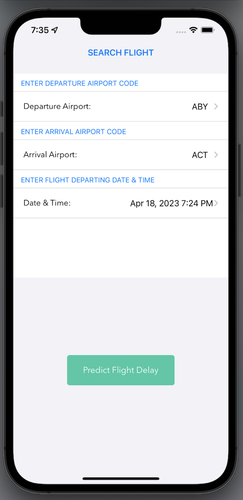
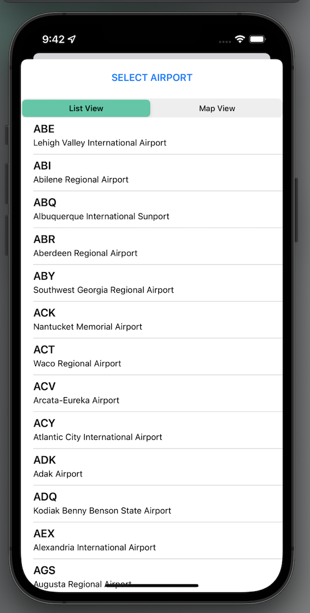
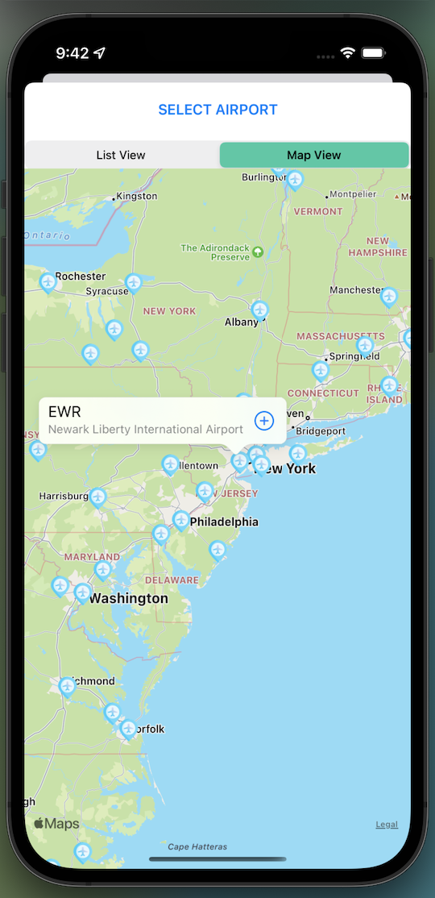
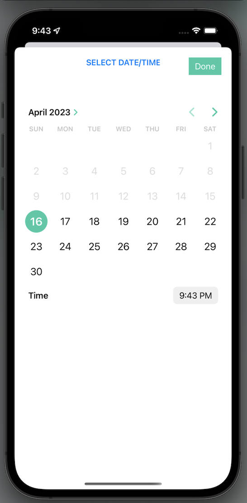
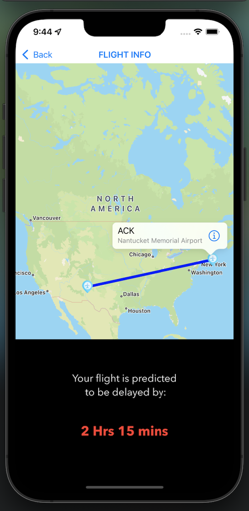

# Flight Delay Predictor

Flight Delay Predictor is an iOS app that helps users predict flight delays based on historical data. The app uses MapKit to display a map of USA airports with pins and lists to select departure and arrival airports, and displays a date picker to select the flight departure date and time. The prediction model was built using Python and later converted to a CoreML model to consume it in the iOS app.

## Requirements
- Xcode 13.3.1 or later
- iOS 14.0 or later

## Installation
Before installing and setting up the code, you will need the following:

- A Mac computer running macOS Catalina or later
- Xcode 13.3.1 or later installed on your Mac. You can download Xcode from the Mac App Store or from the Apple Developer website.

To install and set up the code, follow these steps:

1. Download the project zip file and unzip .
2. Open Team94Project.xcodeproj in Xcode.
3. Build and run the app on a simulator or device.

## EXECUTION

1. On the initial screen, select the departure and arrival airports by tapping on the "Departure Airport:" and "Arrival Airport:" fields. That displays a new screen to select the airport. You can either select from a list of airports or use the map to select an airport by using option 'List View' | 'Map View' given on top of 'Select Airport'
2. Select the departure date and time using the date picker.
3. Tap the "Predict Flight Delay" button to see the predicted delay for the selected flight.

Note: The app requires an active internet connection to fetch and display the airport data and flight delay predictions.

## Screenshots

### Search Flight Screen 

### Airport List Screen

### Airport Map Screen

### Date Picker Screen

### Delay Predict / Flight Information Screen

